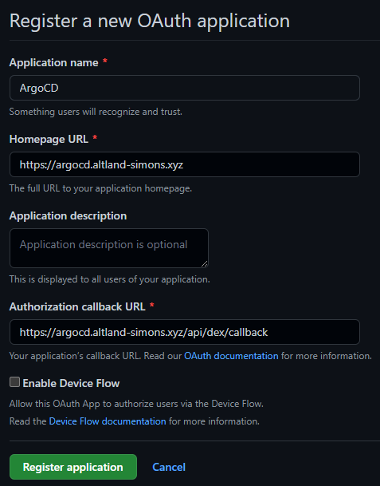

# terraform-github

## Prerequiments

1. GitHub organization
1. AWS Account
    - May spend some money...
    - DONOT FORGOT TO DESTROY
1. S3 Bucket for tfstate
1. Route53 public hostedzone (`example.com`)
    - ArgoCD will use `argocd.example.com` (create by terraform)
    - Sample application will use `sample-app.example.com` (create by terraform)

## Prepare GitHub repositories

1. `cd resources/github`
1. Change `backend-config.hcl` for one's environment.
1. `cp example.tfvars example.auto.tfvars`, and edit (Comment out input values appropriately).
1. Setup backend: `terraform init -backend-config=backend-config.hcl`
1. Export GitHub Token: `export GITHUB_TOKEN=hogehoge`
1. `terraform plan`
1. `terraform apply`

## Create GitHub Application (Cannot create by terraform)

*Following are abstract procedures. See document repo for complete description.*

1. Create application in one's organization.
1. Install application to one's organiztion.
1. Save pem file `github-app.pem` to `resources/github`.
1. (optional) After installation, one can manage installation of GitHub App to a repository by terraform.
    - Terraform requires `installation_id` shown after the first installation.
    - For installation, you need at least one repository.

## Complete GitHub Setting

Configure GitHub App and GitHub Secrets.

1. `cd resources/github`
1. Edit `example.auto.tfvars`
1. `terraform plan`
1. `terraform apply`

## ArgoCD

### Create GitHub OAuth App for ArgoCD Dex

1. `https://github.com/organizations/{your_org}/settings/applications`
1. Create OAuth application
    - 
1. Generate Client secret

### Terraform

1. `cd resources/argocd`
1. Edit `backend-config.hcl`
1. `cp example.tfvars example.auto.tfvars`, and edit
1. `cp example-vaults.tfvars example-vaults.auto.tfvars`, and edit
1. Setup backend: `terraform init -backend-config=backend-config.hcl`
1. `terraform plan`
1. `terraform apply`: May take 20 minites or more.
